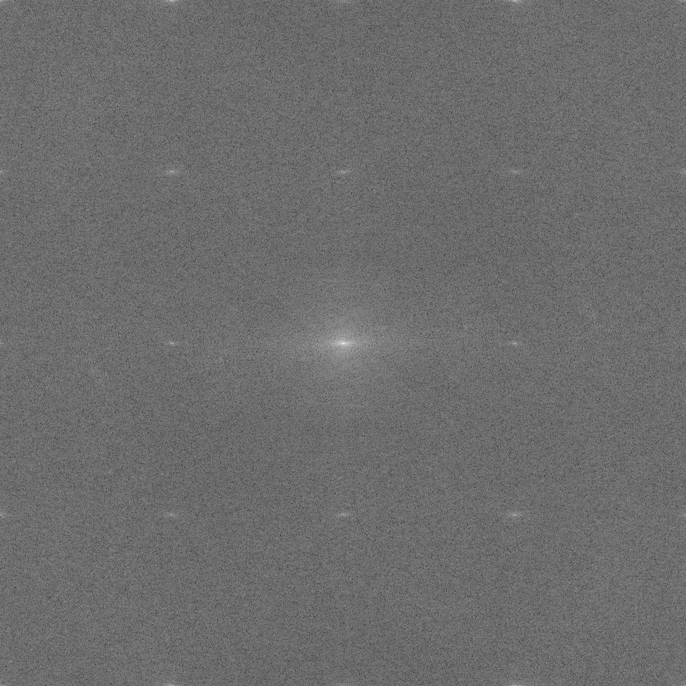
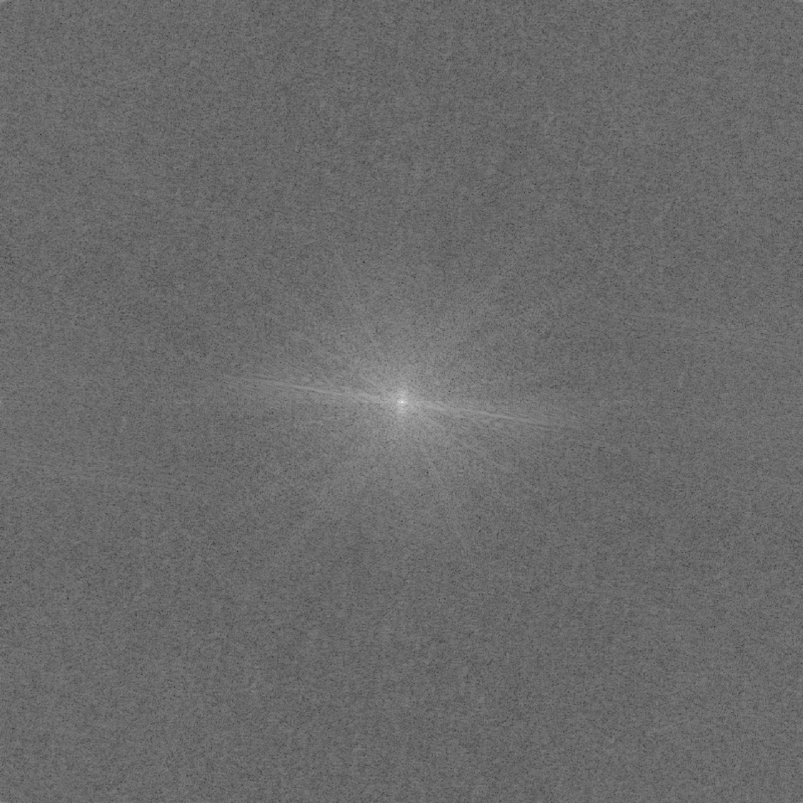
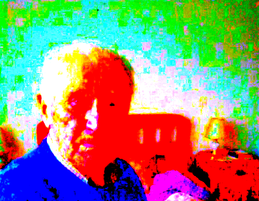
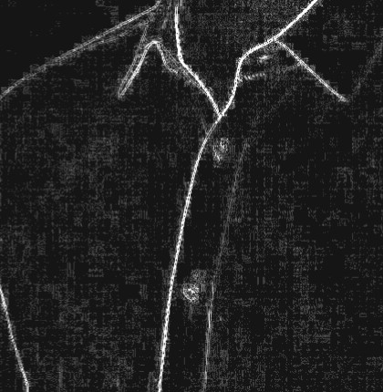
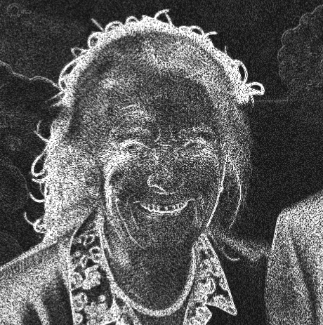

# Suite Forense - Laboratorio Forense

Herramienta web de análisis forense para detectar imágenes generadas por IA usando procesamiento avanzado de imágenes.

## Descripción

Suite Forense permite analizar imágenes con tres técnicas principales: espectro FFT (Transformada Rápida de Fourier), mapa de crominancia y residual espacial. Cada técnica revela artefactos y patrones característicos que suelen aparecer en imágenes sintéticas.

## Características

- **Análisis FFT**: Visualización del espectro de frecuencias con controles de gamma, brillo y limpieza
  - Vista 2D del espectro FFT (imagen)
  - **Gráfico de líneas radial**: Visualización 1D del perfil radial del espectro (nuevo)
  - Detección automática de peaks característicos de imágenes generadas por IA
- **Mapa de Crominancia**: Ajustes de saturación, contraste y rotación de tono
- **Residual Espacial**: Detección de patrones y texturas anómalas
- **Interfaz Intuitiva**: Diseño moderno y fácil de usar
- **Vista de Pantalla Completa**: Análisis detallado por sección
- **Ejemplos Incluidos**: Galería de imágenes reales y generadas por IA

## Inicio Rápido

1. Abre `forensic_tool.html` en un navegador moderno
2. Espera a que OpenCV.js se cargue (estado "Motor Listo")
3. Carga una imagen o selecciona un ejemplo
4. Ajusta los controles para resaltar artefactos

> Nota: Si abres el archivo directamente desde `file://`, los ejemplos locales pueden fallar por CORS. Usa un servidor local para evitarlo.

## Ejecución Local (recomendado)

```bash
python3 -m http.server 8000
```

Luego abre `http://localhost:8000/forensic_tool.html`.

## Técnicas de Análisis

### 1. Espectro FFT (Transformada Rápida de Fourier)

El **espectro FFT** es una representación de la imagen en el dominio de frecuencias. La Transformada Rápida de Fourier convierte la imagen del dominio espacial (píxeles) al dominio de frecuencias, revelando patrones periódicos y regularidades que no son visibles a simple vista.

**Visualizaciones disponibles:**

- **Vista 2D**: Muestra el espectro FFT completo como una imagen, donde se pueden identificar patrones visuales característicos
- **Gráfico de líneas radial**: Visualización 1D que muestra el perfil radial promedio del espectro (promedio de magnitud a cada distancia desde el centro). Esta visualización es consistente con metodologías científicas de análisis forense y facilita la identificación de peaks característicos de imágenes generadas por IA.

El gráfico de líneas muestra:
- **Eje X**: Frecuencia normalizada (0 = DC, 0.5 = Nyquist)
- **Eje Y**: Magnitud del espectro (normalizada)
- **Detección automática de peaks**: Los picos significativos se marcan automáticamente en rojo, ya que son indicadores característicos de imágenes sintéticas

**¿Qué se ve normalmente en una imagen generada por IA?**

En imágenes generadas por IA, el espectro FFT típicamente muestra:
- **Puntos blancos simétricos**: Patrones de puntos brillantes que aparecen en posiciones simétricas, indicando periodicidad artificial introducida por los algoritmos de generación



- **Peaks radiales definidos**: Líneas o patrones radiales que se extienden desde el centro, resultado de procesos de convolución y normalización utilizados en las redes neuronales generativas. En el gráfico de líneas, estos aparecen como picos pronunciados en frecuencias específicas.



- **Patrones regulares**: Estructuras repetitivas que no corresponden a patrones naturales, sino a artefactos del proceso de generación

Estos patrones son indicadores de creación sintética, ya que las imágenes reales fotografiadas naturalmente no presentan estas regularidades tan marcadas en el dominio de frecuencias. Las imágenes reales tienden a mostrar distribuciones espectrales más suaves sin picos pronunciados.

**Referencia científica:**

La implementación del gráfico de líneas radial está basada en la metodología descrita en:

> **"Discrete Fourier Transform in Unmasking Deepfake Images: A Comparative Study of StyleGAN Creations"**  
> Information, MDPI, Volume 15, Issue 11, Article 711 (2024)  
> DOI: [10.3390/info15110711](https://www.mdpi.com/2078-2489/15/11/711)

Este paper demuestra que el análisis del perfil radial del espectro FFT mediante "azimuthal averaging" (promedio radial) es una técnica efectiva para distinguir imágenes generadas por IA de imágenes reales, logrando tasas de precisión superiores al 99% en la detección de deepfakes generados con StyleGAN.

### 2. Mapa de Crominancia

El **mapa de crominancia** representa la información de color de la imagen, separada de la información de luminancia (brillo). La crominancia contiene los componentes de color (matiz y saturación) y es especialmente útil para detectar inconsistencias en el procesamiento de color.

**¿Qué se ve normalmente en una imagen generada por IA?**

En imágenes generadas por IA, el mapa de crominancia típicamente muestra:
- **Ruido de color tipo "arcoíris"**: Patrones de color irregulares que aparecen como manchas multicolores, especialmente visibles cuando se aumenta la saturación al máximo
- **Cuadrados de diversos colores**: Bloques o regiones con colores inconsistentes que no siguen la estructura natural de la imagen
- **Inconsistencias en fondos planos**: En áreas que deberían ser uniformes (como cielos o paredes), aparecen variaciones de color artificiales que revelan el procesamiento por capas de las redes generativas



- **Transiciones de color abruptas**: Cambios bruscos en la crominancia que no corresponden a transiciones naturales de iluminación o materiales

### 3. Residual Espacial

El **residual espacial** es la diferencia entre la imagen original y una versión filtrada o procesada de la misma. Este análisis revela patrones y texturas que quedan como "residuos" después de aplicar ciertos filtros, exponiendo inconsistencias estructurales.

**¿Qué se ve normalmente en una imagen generada por IA?**

En imágenes generadas por IA, el residual espacial típicamente muestra:
- **Texturas en cuadrícula**: Patrones de tipo "ajedrez" o cuadrícula que cruzan los límites de los objetos, resultado de las operaciones de convolución y pooling utilizadas en las redes neuronales
- **Inconsistencias de tipo "ajedrez"**: Patrones repetitivos que no respetan los bordes naturales de los objetos, indicando que la generación se realizó en bloques o parches



- **Artefactos de bordes**: Irregularidades en los bordes de los objetos que sugieren que fueron generados o ensamblados de manera artificial

<table>
  <thead>
    <tr>
      <th>Residual</th>
      <th>Original</th>
    </tr>
  </thead>
  <tbody>
    <tr>
      <td>
        
      </td>
      <td>
        
      </td>
    </tr>
  </tbody>
</table>


## Flujo de Análisis Recomendado

- **FFT**: Si aparecen puntos blancos simétricos o peaks radiales definidos, es un indicador estadístico primario de creación sintética.
- **Residual**: Busca texturas en cuadrícula o inconsistencias de tipo "ajedrez" que crucen los límites de los objetos.
- **Croma**: Aumenta la saturación al 1000%. El ruido de color tipo "arcoíris" o cuadrados de diversos colores y consistencias en fondos planos sugiere generación con IA.

## Actualizar Ejemplos

Para agregar, eliminar o renombrar imágenes de ejemplo:

1. Modifica los archivos en la carpeta `examples/`
   - Las imágenes reales deben empezar con `real_` (ej: `real_1_foto.jpg`)
   - Las imágenes generadas por IA deben empezar con `ai_` (ej: `ai_1_midjourney.png`)

2. Ejecuta el script de generación en la terminal:
   ```bash
   node generate_examples.js
   ```

3. Recarga la página web para ver los cambios

## Requisitos Técnicos

- Navegador web moderno (Chrome, Firefox, Safari, Edge)
- Conexión a internet (para cargar OpenCV.js desde CDN)
- Para cargar ejemplos locales, se recomienda usar un servidor HTTP local

## Tecnologías Utilizadas

- **OpenCV.js**: Biblioteca de visión por computadora para procesamiento de imágenes
- **HTML5 Canvas**: Para renderizado de visualizaciones
- **Tailwind CSS**: Framework CSS para el diseño
- **JavaScript Vanilla**: Lógica de la aplicación

## Referencias Científicas

- **Análisis FFT Radial**: Basado en la metodología de "azimuthal averaging" descrita en:
  - Li, Y., et al. (2024). "Discrete Fourier Transform in Unmasking Deepfake Images: A Comparative Study of StyleGAN Creations". *Information*, 15(11), 711. [https://www.mdpi.com/2078-2489/15/11/711](https://www.mdpi.com/2078-2489/15/11/711)

- **Detección de Imágenes Sintéticas**: Metodologías y técnicas de análisis forense digital:
  - Farid, H. (2024). "How to spot fake AI photos". TED Talk. [https://www.ted.com/talks/hany_farid_how_to_spot_fake_ai_photos](https://www.ted.com/talks/hany_farid_how_to_spot_fake_ai_photos)

## Estructura del Proyecto

```
suite-forense/
├── forensic_tool.html      # Archivo principal HTML
├── forensic_tool.js        # Lógica de procesamiento y análisis
├── forensic_tool.css       # Estilos de la aplicación
├── examples_list.js        # Lista de imágenes de ejemplo
├── examples/               # Carpeta con imágenes de ejemplo
│   ├── ai_*.png/jpg        # Imágenes generadas por IA
│   └── real_*.png/jpg      # Imágenes reales
└── README.md               # Este archivo
```

## Notas

- El análisis forense de imágenes es una técnica compleja y los resultados deben interpretarse con cuidado
- Algunas imágenes reales pueden mostrar ciertos artefactos similares debido a compresión o procesamiento (ej: ver camiseta del ejemplo 3_Seba. Se ven cuadros pues la imagen fue comprimida antes de ser procesada, pero estos cuadros son más pequeños de los que se ven en las imagenes generadas)
- La combinación de las tres técnicas proporciona una evaluación más confiable que el uso individual de cada una


## Bugs conocidos
- El espectro FFT es algo dificil de correr en la memoria del navegador. Computadores con poca RAM van a tener dificultades y errores, incluyendo que no se cargue el espectro FFT o que al cambiarle parametros se rompa.

---

**Actualizado**: 14 de enero de 2026  
**Desarrollado por**: EvoAcademy  
**Versión**: 1.1.0 (incluye visualización de gráfico radial FFT)
